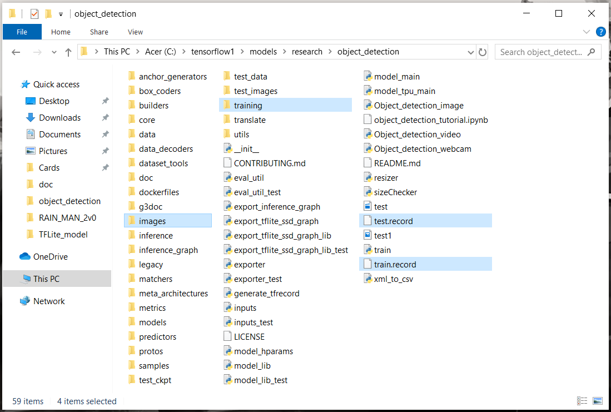
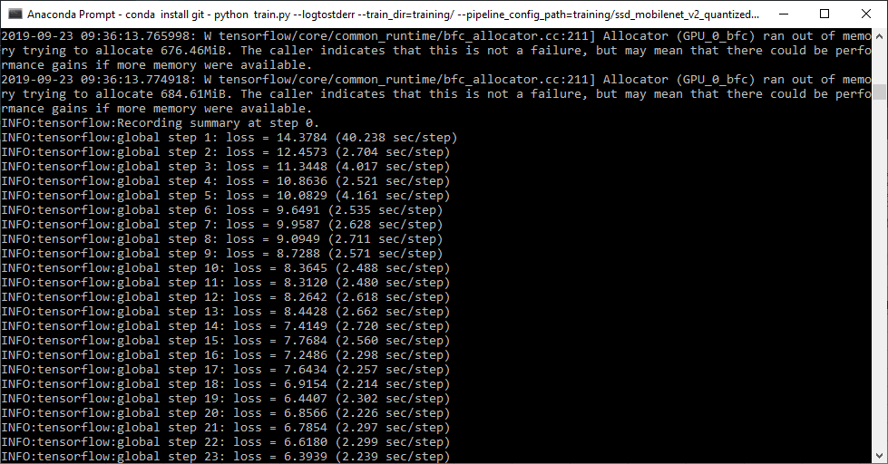
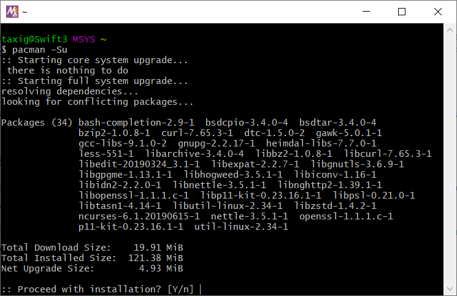
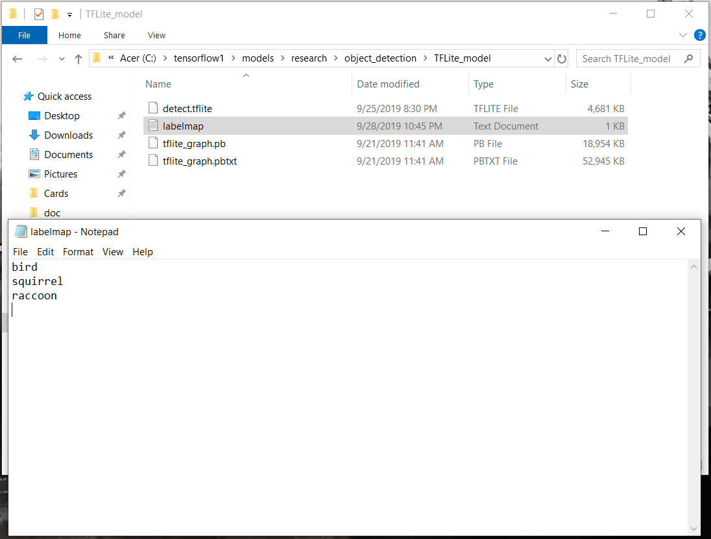
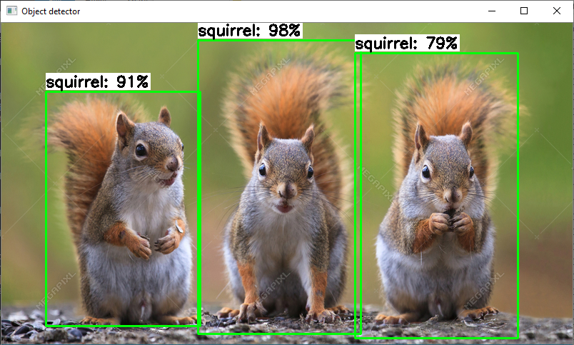

# TensorFlow-Lite-Object-Detection-on-Android-and-Raspberry-Pi
A guide showing how to train TensorFlow Lite object detection models and run them on Android, the Raspberry Pi, and more!

<p align="center">
   
</p>

## Introduction
TensorFlow Lite is an optimized framework for deploying lightweight deep learning models on resource-constrained edge devices. TensorFlow Lite models have faster inference time and require less processing power, so they can be used to obtain faster performance in realtime applications. This guide provides step-by-step instructions for how train a custom TensorFlow Object Detection model, convert it into an optimized format that can be used by TensorFlow Lite, and run it on Android phones or the Raspberry Pi.

The guide is broken into three major portions. Each portion will have its own dedicated README file in this repository.
1. How to Train, Convert, and Run Custom TensorFlow Lite Object Detection Models on Windows 10  *<--- You are here!*
2. [How to Run TensorFlow Lite Object Detection Models on the Raspberry Pi (with optional Coral USB Accelerator)](https://github.com/EdjeElectronics/TensorFlow-Lite-Object-Detection-on-Android-and-Raspberry-Pi/blob/master/Raspberry_Pi_Guide.md)
3. How to Run TensorFlow Lite Object Detection Models on Android Devices
  (Still not complete)

This repository also contains Python code for running the newly converted TensorFlow Lite model to perform detection on images, videos, or webcam feeds.

### A Note on Versions
I used TensorFlow v1.13 while creating this guide, because TF v1.13 is a stable version that has great support from Anaconda. I will periodically update the guide to make sure it works with newer versions of TensorFlow. 

The TensorFlow team is always hard at work releasing updated versions of TensorFlow. I recommend picking one version and sticking with it for all your TensorFlow projects. Every part of this guide should work with newer or older versions, but you may need to use different versions of the tools needed to run or build TensorFlow (CUDA, cuDNN, bazel, etc). Google has provided a list of build configurations for [Linux](https://www.tensorflow.org/install/source#linux), [macOS](https://www.tensorflow.org/install/source#macos), and [Windows](https://www.tensorflow.org/install/source_windows#tested_build_configurations) that show which tool versions were used to build and run each version of TensorFlow.

## Part 1 - How to Train, Convert, and Run Custom TensorFlow Lite Object Detection Models on Windows 10
Part 1 of this guide gives instructions for training and deploying your own custom TensorFlow Lite object detection model on a Windows 10 PC. The guide is based off the [tutorial in the TensorFlow Object Detection repository](https://github.com/tensorflow/models/blob/master/research/object_detection/g3doc/running_on_mobile_tensorflowlite.md), but it gives more detailed instructions and is written specifically for Windows. (It will work on Linux too with some minor changes, which I leave as an exercise for the Linux user.)

There are three primary steps to training and deploying a TensorFlow Lite model:
1. [Train a quantized SSD-MobileNet model using TensorFlow, and export frozen graph for TensorFlow Lite](https://github.com/EdjeElectronics/TensorFlow-Lite-Object-Detection-on-Android-and-Raspberry-Pi#step-1-train-quantized-ssd-mobilenet-model-and-export-frozen-tensorflow-lite-graph)
2. [Build TensorFlow from source on your PC](https://github.com/EdjeElectronics/TensorFlow-Lite-Object-Detection-on-Android-and-Raspberry-Pi#step-2-build-tensorflow-from-source)
3. [Use TensorFlow Lite Optimizing Converter (TOCO) to create optimzed TensorFlow Lite model](https://github.com/EdjeElectronics/TensorFlow-Lite-Object-Detection-on-Android-and-Raspberry-Pi#step-3-use-toco-to-create-optimzed-tensorflow-lite-model)

This portion is a continuation of my previous guide: [How To Train an Object Detection Model Using TensorFlow on Windows 10](https://github.com/EdjeElectronics/TensorFlow-Object-Detection-API-Tutorial-Train-Multiple-Objects-Windows-10). I'll assume you have already set up TensorFlow to train a custom object detection model as described in that guide, including:
* Setting up an Anaconda virtual environment for training
* Setting up TensorFlow directory structure
* Gathering and labeling training images
* Preparing training data (generating TFRecords and label map)

This tutorial uses the same Anaconda virtual environment, files, and directory structure that was set up in the previous one. 

Through the course of the guide, I'll use a bird, squirrel, and raccoon detector model I've been working on as an example. The intent of this detection model is to watch a bird feeder, and record videos of birds while triggering an alarm if a squirrel or raccoon is stealing from it! I'll show the steps needed to train, convert, and run a quantized TensorFlow Lite version of the bird/squirrel/raccoon detector.
 
Parts 2 and 3 of this guide will go on to show how to deploy this newly trained TensorFlow Lite model on the Raspberry Pi or an Android device. If you're not feeling up to training and converting your own TensorFlow Lite model, you can skip Part 1 and use my custom-trained TFLite BSR detection model [(which you can download from Dropbox here)](https://www.dropbox.com/s/cpaon1j1r1yzflx/BirdSquirrelRaccoon_TFLite_model.zip?dl=0) or use the [TF Lite starter detection model](https://storage.googleapis.com/download.tensorflow.org/models/tflite/coco_ssd_mobilenet_v1_1.0_quant_2018_06_29.zip) (taken from https://www.tensorflow.org/lite/models/object_detection/overview) for Part 2 or Part 3.
 
### Step 1: Train Quantized SSD-MobileNet Model and Export Frozen TensorFlow Lite Graph
First, we’ll use transfer learning to train a “quantized” SSD-MobileNet model. Quantized models use 8-bit integer values instead of 32-bit floating values within the neural network, allowing them to run much more efficiently on GPUs or specialized TPUs (TensorFlow Processing Units).

You can also use a standard SSD-MobileNet model (V1 or V2), but it will not run quite as fast as the quantized model. Also, you will not be able to run it on the Google Coral TPU Accelerator. If you’re using an SSD-MobileNet model that has already been trained, you can skip to [Step 1d](https://github.com/EdjeElectronics/TensorFlow-Lite-Object-Detection-on-Android-and-Raspberry-Pi#step-1d-export-frozen-inference-graph-for-tensorflow-lite) of this guide.

**If you get any errors during this process, please look at the [FAQ section](https://github.com/EdjeElectronics/TensorFlow-Lite-Object-Detection-on-Android-and-Raspberry-Pi#frequently-asked-questions-and-common-errors) at the bottom of this guide! It gives solutions to common errors that occur.**

As I mentioned prevoiusly, this guide assumes you have already followed my [previous TensorFlow tutorial](https://github.com/EdjeElectronics/TensorFlow-Object-Detection-API-Tutorial-Train-Multiple-Objects-Windows-10) and set up the Anaconda virtual environment and full directory structure needed for using the TensorFlow Object Detection API. If you've done so, you should have a folder at C:\tensorflow1\models\research\object_detection that has everything needed for training. (If you used a different base folder name than "tensorflow1", that's fine - just make sure you continue to use that name throughout this guide.)

Here's what your \object_detection folder should look like:
<p align="center">
   
</p>

If you don't have this folder, please go to my [previous tutorial](https://github.com/EdjeElectronics/TensorFlow-Object-Detection-API-Tutorial-Train-Multiple-Objects-Windows-10) and work through at least Steps 1 and 2. If you'd like to train your own model to detect custom objects, you'll also need to work through Steps 3, 4, and 5. If you don't want to train your own model but want to practice the process for converting a model to TensorFlow Lite, you can download the quantized MobileNet-SSD model (see next paragraph) and then skip to [Step 1d](https://github.com/EdjeElectronics/TensorFlow-Lite-Object-Detection-on-Android-and-Raspberry-Pi#step-1d-export-frozen-inference-graph-for-tensorflow-lite).

#### Step 1a. Download and extract quantized SSD-MobileNet model
Google provides several quantized object detection models in their [detection model zoo](https://github.com/tensorflow/models/blob/master/research/object_detection/g3doc/tf1_detection_zoo.md). This tutorial will use the SSD-MobileNet-V2-Quantized-COCO model. Download the model [here](http://download.tensorflow.org/models/object_detection/ssd_mobilenet_v2_quantized_300x300_coco_2019_01_03.tar.gz). **Note: TensorFlow Lite does NOT support RCNN models such as Faster-RCNN! It only supports SSD models.** 

Move the downloaded .tar.gz file to the C:\tensorflow1\models\research\object_detection folder. (Henceforth, this folder will be referred to as the “\object_detection” folder.)  Unzip the .tar.gz file using a file archiver like WinZip or 7-Zip. After the file has been fully unzipped, you should have a folder called "ssd_mobilenet_v2_quantized_300x300_coco_2019_01_03" within the \object_detection folder.

#### Step 1b. Configure training
If you're training your own TensorFlow Lite model, make sure the following items from my [previous guide](https://github.com/EdjeElectronics/TensorFlow-Object-Detection-API-Tutorial-Train-Multiple-Objects-Windows-10) have been completed:
* Train and test images and their XML label files are placed in the \object_detection\images\train and \object_detection\images\test folders
* train_labels.csv and test_labels.csv have been generated and are located in the \object_detection\images folder
* train.record and test.record have been generated and are located in the \object_detection folder
* labelmap.pbtxt file has been created and is located in the \object_detection\training folder
* proto files in \object_detection\protos have been generated

If you have any questions about these files or don’t know how to generate them, [Steps 2, 3, 4, and 5 of my previous tutorial](https://github.com/EdjeElectronics/TensorFlow-Object-Detection-API-Tutorial-Train-Multiple-Objects-Windows-10) show how they are all created.

Copy the ssd_mobilenet_v2_quantized_300x300_coco.config file from the \object_detection\samples\configs folder to the \object_detection\training folder. Then, open the file using a text editor.

Make the following changes to the ssd_mobilenet_v2_quantized_300x300_coco.config file. Note: The paths must be entered with single forward slashes (NOT backslashes), or TensorFlow will give a file path error when trying to train the model! Also, the paths must be in double quotation marks ( " ), not single quotation marks ( ' ).

* Line 9. Change num_classes to the number of different objects you want the classifier to detect. For my bird/squirrel/raccoon detector example, there are three classes, so I set num_classes: 3

* Line 141. Change batch_size: 24 to batch_size: 6 . The smaller batch size will prevent OOM (Out of Memory) errors during training.

* Line 156. Change fine_tune_checkpoint to: "C:/tensorflow1/models/research/object_detection/ ssd_mobilenet_v2_quantized_300x300_coco_2019_01_03/model.ckpt"

* Line 175. Change input_path to: "C:/tensorflow1/models/research/object_detection/train.record"

* Line 177. Change label_map_path to: "C:/tensorflow1/models/research/object_detection/training/labelmap.pbtxt"

* Line 181. Change num_examples to the number of images you have in the \images\test directory. For my bird/squirrel/raccoon detector example, there are 582 test images, so I set num_examples: 582.

* Line 189. Change input_path to: "C:/tensorflow1/models/research/object_detection/test.record"

* Line 191. Change label_map_path to: "C:/tensorflow1/models/research/object_detection/training/labelmap.pbtxt"
  
Save and exit the training file after the changes have been made.
  
#### Step 1c. Run training in Anaconda virtual environment
All that's left to do is train the model! First, move the “train.py” file from the \object_detection\legacy folder into the main \object_detection folder. (See the [FAQ](https://github.com/EdjeElectronics/TensorFlow-Lite-Object-Detection-on-Android-and-Raspberry-Pi#frequently-asked-questions-and-common-errors) for why I am using the legacy train.py script rather than model_main.py for training.)
  
Then, open a new Anaconda Prompt window by searching for “Anaconda Prompt” in the Start menu and clicking on it. Activate the “tensorflow1” virtual environment (which was set up in my [previous tutorial](https://github.com/EdjeElectronics/TensorFlow-Object-Detection-API-Tutorial-Train-Multiple-Objects-Windows-10)) by issuing: 

```
activate tensorflow1
```

Then, set the PYTHONPATH environment variable by issuing:

```
set PYTHONPATH=C:\tensorflow1\models;C:\tensorflow1\models\research;C:\tensorflow1\models\research\slim
```

Next, change directories to the \object_detection folder:

```
cd C:\tensorflow1\models\research\object_detection
```

Finally, train the model by issuing:

```
python train.py --logtostderr –train_dir=training/ --pipeline_config_path=training/ssd_mobilenet_v2_quantized_300x300_coco.config
```

If everything was set up correctly, the model will begin training after a couple minutes of initialization.

<p align="center">
   
</p>

Allow the model to train until the loss consistently drops below 2. For my bird/squirrel/raccoon detector model, this took about 9000 steps, or 8 hours of training. (Time will vary depending on how powerful your CPU and GPU are. Please see [Step 6 of my previous tutorial](https://github.com/EdjeElectronics/TensorFlow-Object-Detection-API-Tutorial-Train-Multiple-Objects-Windows-10/blob/master/README.md#6-run-the-training) for more information on training and an explanation of how to view the progress of the training job using TensorBoard.) 

Once training is complete (i.e. the loss has consistently dropped below 2), press Ctrl+C to stop training. The latest checkpoint will be saved in the \object_detection\training folder, and we will use that checkpoint to export the frozen TensorFlow Lite graph. Take note of the checkpoint number of the model.ckpt file in the training folder (i.e. model.ckpt-XXXX), as it will be used later.

#### Step 1d. Export frozen inference graph for TensorFlow Lite
Now that training has finished, the model can be exported for conversion to TensorFlow Lite using the export_tflite_ssd_graph.py script. First, create a folder in \object_detection called “TFLite_model” by issuing: 

```
mkdir TFLite_model
```

Next, let’s set up some environment variables so the commands are easier to type out. Issue the following commands in Anaconda Prompt. (Note, the XXXX in the second command should be replaced with the highest-numbered model.ckpt file in the \object_detection\training folder.) 

```
set CONFIG_FILE=C:\\tensorflow1\models\research\object_detection\training\ssd_mobilenet_v2_quantized_300x300_coco.config
set CHECKPOINT_PATH=C:\\tensorflow1\models\research\object_detection\training\model.ckpt-XXXX
set OUTPUT_DIR=C:\\tensorflow1\models\research\object_detection\TFLite_model
```

Now that those are set up, issue this command to export the model for TensorFlow Lite:

```
python export_tflite_ssd_graph.py --pipeline_config_path=%CONFIG_FILE% --trained_checkpoint_prefix=%CHECKPOINT_PATH% --output_directory=%OUTPUT_DIR% --add_postprocessing_op=true
```

After the command has executed, there should be two new files in the \object_detection\TFLite_model folder: tflite_graph.pb and tflite_graph.pbtxt. 

That’s it! The new inference graph has been trained and exported. This inference graph's architecture and network operations are compatible with TensorFlow Lite's framework. However, the graph still needs to be converted to an actual TensorFlow Lite model. We'll do that in Step 3. First, we have to build TensorFlow from source. On to Step 2!

### Step 2. Build TensorFlow From Source
To convert the frozen graph we just exported into a model that can be used by TensorFlow Lite, it has to be run through the TensorFlow Lite Optimizing Converter (TOCO). Unfortunately, to use TOCO, we have to build TensorFlow from source on our computer. To do this, we’ll create a separate Anaconda virtual environment for building TensorFlow. 

This part of the tutorial breaks down step-by-step how to build TensorFlow from source on your Windows PC. It follows the [Build TensorFlow From Source on Windows](https://www.tensorflow.org/install/source_windows) instructions given on the official TensorFlow website, with some slight modifications. 

This guide will show how to build either the CPU-only version of TensorFlow or the GPU-enabled version of TensorFlow v1.13. If you would like to build a version other than TF v1.13, you can still use this guide, but check the [build configuration list](https://www.tensorflow.org/install/source_windows#tested_build_configurations) and make sure you use the correct package versions. 

**If you are only building TensorFlow to convert a TensorFlow Lite object detection model, I recommend building the CPU-only version!** It takes very little computational effort to export the model, so your CPU can do it just fine without help from your GPU. If you’d like to build the GPU-enabled version anyway, then you need to have the appropriate version of CUDA and cuDNN installed. [The TensorFlow installation guide](https://www.tensorflow.org/install/gpu#windows_setup) explains how to install CUDA and cuDNN. Check the [build configuration list](https://www.tensorflow.org/install/source_windows#tested_build_configurations) to see which versions of CUDA and cuDNN are compatible with which versions of TensorFlow.

**If you get any errors during this process, please look at the [FAQ section](https://github.com/EdjeElectronics/TensorFlow-Lite-Object-Detection-on-Android-and-Raspberry-Pi#frequently-asked-questions-and-common-errors) at the bottom of this guide! It gives solutions to common errors that occur.**

#### Step 2a. Install MSYS2
MSYS2 has some binary tools needed for building TensorFlow. It also automatically converts Windows-style directory paths to Linux-style paths when using Bazel. The Bazel build won’t work without MSYS2 installed! 

First, install MSYS2 by following the instructions on the [MSYS2 website](https://www.msys2.org/). Download the msys2-x86_64 executable file and run it. Use the default options for installation. After installing, open MSYS2 and issue:

```
pacman -Syu
```

<Picture of MSYS2 shell to be added here>

After it's completed, close the window, re-open it, and then issue the following two commands:

```
pacman -Su
pacman -S patch unzip
```

<p align="center">
   
</p>

This updates MSYS2’s package manager and downloads the patch and unzip packages. Now, close the MSYS2 window. We'll add the MSYS2 binary to the PATH environment variable in Step 2c.

#### Step 2b. Install Visual C++ Build Tools 2015
Install Microsoft Build Tools 2015 and Microsoft Visual C++ 2015 Redistributable by visiting the [Visual Studio older downloads](https://visualstudio.microsoft.com/vs/older-downloads/) page. Click the “Redistributables and Build Tools” dropdown at the bottom of the list.  Download and install the following two packages:

* **Microsoft Build Tools 2015 Update 3** - Use the default installation options in the install wizard. Once you begin installing, it goes through a fairly large download, so it will take a while if you have a slow internet connection. It may give you some warnings saying build tools or redistributables have already been installed. If so, that's fine; just click through them.
* **Microsoft Visual C++ 2015 Redistributable Update 3** – This may give you an error saying the redistributable has already been installed. If so, that’s fine.

Restart your PC after installation has finished.

#### Step 2c. Update Anaconda and create tensorflow-build environment
Now that the Visual Studio tools are installed and your PC is freshly restarted, open a new Anaconda Prompt window. First, update Anaconda to make sure its package list is up to date. In the Anaconda Prompt window, issue these two commands: 

```
conda update -n base -c defaults conda
conda update --all
```

The update process may take up to an hour, depending on how it's been since you installed or updated Anaconda. Next, create a new Anaconda virtual environment called “tensorflow-build”. We’ll work in this environment for the rest of the build process. Create and activate the environment by issuing:

```
conda create -n tensorflow-build pip python=3.6
conda activate tensorflow-build
```

After the environment is activated, you should see (tensorflow-build) before the active path in the command window. 

Update pip by issuing:

```
python -m pip install --upgrade pip
```

We'll use Anaconda's git package to download the TensorFlow repository, so install git using:

```
conda install -c anaconda git
```

Next, add the MSYS2 binaries to this environment's PATH variable by issuing:

```
set PATH=%PATH%;C:\msys64\usr\bin
```

(If MSYS2 is installed in a different location than C:\msys64, use that location instead.) You’ll have to re-issue this PATH command if you ever close and re-open the Anaconda Prompt window. 

#### Step 2d. Download Bazel and Python package dependencies
Next, we’ll install Bazel and some other Python packages that are used for building TensorFlow. Install the necessary Python packages by issuing: 

```
pip install six numpy wheel
pip install keras_applications==1.0.6 --no-deps
pip install keras_preprocessing==1.0.5 --no-deps
```

Then install Bazel v0.21.0 by issuing the following command. (If you are building a version of TensorFlow other than v1.13, you may need to use a different version of Bazel.)

```
conda install -c conda-forge bazel=0.21.0
```

#### Step 2d. Download TensorFlow source and configure build
Time to download TensorFlow’s source code from GitHub! Issue the following commands to create a new folder directly in C:\ called “tensorflow-build” and cd into it:

```
mkdir C:\tensorflow-build
cd C:\tensorflow-build
```

Then, clone the TensorFlow repository and cd into it by issuing: 

```
git clone https://github.com/tensorflow/tensorflow.git 
cd tensorflow 
```

Next, check out the branch for TensorFlow v1.13: 

```
git checkout r1.13
```

The version you check out should match the TensorFlow version you used to train your model in [Step 1](https://github.com/EdjeElectronics/TensorFlow-Lite-Object-Detection-on-Android-and-Raspberry-Pi#step-1-train-quantized-ssd-mobilenet-model-and-export-frozen-tensorflow-lite-graph). If you used a different version than TF v1.13, then replace "1.13" with the version you used. See the [FAQs section](https://github.com/EdjeElectronics/TensorFlow-Lite-Object-Detection-on-Android-and-Raspberry-Pi#how-do-i-check-which-tensorflow-version-i-used-to-train-my-detection-model) for instructions on how to check the TensorFlow version you used for training.

Next, we’ll configure the TensorFlow build using the configure.py script. From the C:\tensorflow-build\tensorflow directory, issue:

```
python ./configure.py
```

This will initiate a Bazel session. As I mentioned before, you can build either the CPU-only version of TensorFlow or the GPU-enabled version of TensorFlow. If you're only using this TensorFlow build to convert your TensorFlow Lite model, **I recommend building the CPU-only version**. If you’d still like to build the GPU-enabled version for some other reason, then you need to have the appropriate version of CUDA and cuDNN installed. This guide doesn't cover building the GPU-enabled version of TensorFlow, but you can try following the official build instructions on the [TensorFlow website](https://www.tensorflow.org/install/source_windows).

Here’s what the configuration session will look like if you are building for CPU only. Basically, press Enter to select the default option for each question.

```
You have bazel 0.21.0- (@non-git) installed. 

Please specify the location of python. [Default is C:\ProgramData\Anaconda3\envs\tensorflow-build\python.exe]: 
  
Found possible Python library paths: 

  C:\ProgramData\Anaconda3\envs\tensorflow-build\lib\site-packages 

Please input the desired Python library path to use.  Default is [C:\ProgramData\Anaconda3\envs\tensorflow-build\lib\site-packages] 

Do you wish to build TensorFlow with XLA JIT support? [y/N]: N 
No XLA JIT support will be enabled for TensorFlow. 

Do you wish to build TensorFlow with ROCm support? [y/N]: N 
No ROCm support will be enabled for TensorFlow. 
  
Do you wish to build TensorFlow with CUDA support? [y/N]: N 
No CUDA support will be enabled for TensorFlow. 
```

Once the configuration is finished, TensorFlow is ready to be bulit!

#### Step 2e. Build TensorFlow package
Next, use Bazel to create the package builder for TensorFlow. To create the CPU-only version, issue the following command. The build process took about 70 minutes on my computer. 

```
bazel build --config=opt //tensorflow/tools/pip_package:build_pip_package 
```

Now that the package builder has been created, let’s use it to build the actual TensorFlow wheel file. Issue the following command (it took about 5 minutes to complete on my computer): 

```
bazel-bin\tensorflow\tools\pip_package\build_pip_package C:/tmp/tensorflow_pkg 
```

This creates the wheel file and places it in C:\tmp\tensorflow_pkg.

#### Step 2f. Install TensorFlow and test it out!
TensorFlow is finally ready to be installed! Open File Explorer and browse to the C:\tmp\tensorflow_pkg folder. Copy the full filename of the .whl file, and paste it in the following command:

```
pip3 install C:/tmp/tensorflow_pkg/<Paste full .whl filename here>
```

That's it! TensorFlow is installed! Let's make sure it installed correctly by opening a Python shell:

```
python
```

Once the shell is opened, issue these commands:

```
>>> import tensorflow as tf
>>> tf.__version__
```

If everything was installed properly, it will respond with the installed version of TensorFlow. Note: You may get some deprecation warnings after the "import tensorflow as tf" command. As long as they are warnings and not actual errors, you can ignore them! Exit the shell by issuing:

```
exit()
```

With TensorFlow installed, we can finally convert our trained model into a TensorFlow Lite model. On to the last step: Step 3!

### Step 3. Use TOCO to Create Optimzed TensorFlow Lite Model, Create Label Map, Run Model
Although we've already exported a frozen graph of our detection model for TensorFlow Lite, we still need run it through the TensorFlow Lite Optimizing Converter (TOCO) before it will work with the TensorFlow Lite interpreter. TOCO converts models into an optimized FlatBuffer format that allows them to run efficiently on TensorFlow Lite. We also need to create a new label map before running the model.

#### Step 3a. Create optimized TensorFlow Lite model
First, we’ll run the model through TOCO to create an optimzed TensorFLow Lite model. The TOCO tool lives deep in the C:\tensorflow-build directory, and it will be run from the “tensorflow-build” Anaconda virtual environment that we created and used during Step 2. Meanwhile, the model we trained in Step 1 lives inside the C:\tensorflow1\models\research\object_detection\TFLite_model directory. We’ll create an environment variable called OUTPUT_DIR that points at the correct model directory to make it easier to enter the TOCO command.

If you don't already have an Anaconda Prompt window open with the "tensorflow-build" environment active and working in C:\tensorflow-build, open a new Anaconda Prompt window and issue:

```
activate tensorflow-build
cd C:\tensorflow-build
```

Create the OUTPUT_DIR environment variable by issuing:

```
set OUTPUT_DIR=C:\\tensorflow1\models\research\object_detection\TFLite_model
```

Next, use Bazel to run the model through the TOCO tool by issuing this command:

```
bazel run --config=opt tensorflow/lite/toco:toco -- --input_file=%OUTPUT_DIR%/tflite_graph.pb --output_file=%OUTPUT_DIR%/detect.tflite --input_shapes=1,300,300,3 --input_arrays=normalized_input_image_tensor --output_arrays=TFLite_Detection_PostProcess,TFLite_Detection_PostProcess:1,TFLite_Detection_PostProcess:2,TFLite_Detection_PostProcess:3 --inference_type=QUANTIZED_UINT8 --mean_values=128 --std_values=128 --change_concat_input_ranges=false --allow_custom_ops 
```

Note: If you are using a floating, non-quantized SSD model (e.g. the ssdlite_mobilenet_v2_coco model rather than the ssd_mobilenet_v2_quantized_coco model), the Bazel TOCO command must be modified slightly:

```
bazel run --config=opt tensorflow/lite/toco:toco -- --input_file=$OUTPUT_DIR/tflite_graph.pb --output_file=$OUTPUT_DIR/detect.tflite --input_shapes=1,300,300,3 --input_arrays=normalized_input_image_tensor --output_arrays=TFLite_Detection_PostProcess,TFLite_Detection_PostProcess:1,TFLite_Detection_PostProcess:2,TFLite_Detection_PostProcess:3 --inference_type=FLOAT --allow_custom_ops 
```

If you are using Linux, make sure to use the commands given in the [official TensorFlow instructions here](https://github.com/tensorflow/models/blob/master/research/object_detection/g3doc/running_on_mobile_tensorflowlite.md). I removed the ' characters from the command, because for some reason they cause errors on Windows!

After the command finishes running, you should see a file called detect.tflite in the \object_detection\TFLite_model directory. This is the model that can be used with TensorFlow Lite!

#### Step 3b. Create new label map
For some reason, TensorFlow Lite uses a different label map format than classic TensorFlow. The classic TensorFlow label map format looks like this (you can see an example in the \object_detection\data\mscoco_label_map.pbtxt file): 

```
item { 
  name: "/m/01g317" 
  id: 1 
  display_name: "person" 
} 
item { 
  name: "/m/0199g" 
  id: 2 
  display_name: "bicycle" 
} 
item { 
  name: "/m/0k4j" 
  id: 3 
  display_name: "car" 
} 
item { 
  name: "/m/04_sv" 
  id: 4 
  display_name: "motorcycle" 
} 
And so on...
```

However, the label map provided with the [example TensorFlow Lite object detection model](https://storage.googleapis.com/download.tensorflow.org/models/tflite/coco_ssd_mobilenet_v1_1.0_quant_2018_06_29.zip) looks like this:

```
person 
bicycle 
car 
motorcycle 
And so on...
```
 
Basically, rather than explicitly stating the name and ID number for each class like the classic TensorFlow label map format does, the TensorFlow Lite format just lists each class. To stay consistent with the example provided by Google, I’m going to stick with the TensorFlow Lite label map format for this guide.

Thus, we need to create a new label map that matches the TensorFlow Lite style. Open a text editor and list each class in order of their class number. Then, save the file as “labelmap.txt” in the TFLite_model folder. As an example, here's what the labelmap.txt file for my bird/squirrel/raccoon detector looks like:

<p align="center">
   
</p>
 
Now we’re ready to run the model!

#### Step 3c. Run the TensorFlow Lite model!
I wrote three Python scripts to run the TensorFlow Lite object detection model on an image, video, or webcam feed: TFLite_detection_image.py, TFLite_detection_video.py, and [TFLite_detection_wecam.py](https://github.com/EdjeElectronics/TensorFlow-Lite-Object-Detection-on-Android-and-Raspberry-Pi/blob/master/TFLite_detection_webcam.py). The scripts are based off the label_image.py example given in the [TensorFlow Lite examples GitHub repository](https://github.com/tensorflow/tensorflow/blob/master/tensorflow/lite/examples/python/label_image.py).

We’ll download the Python scripts directly from this repository. First, install wget for Anaconda by issuing:

```
conda install -c menpo wget
```

Once it's installed, download the scripts by issuing:

```
wget https://raw.githubusercontent.com/EdjeElectronics/TensorFlow-Lite-Object-Detection-on-Android-and-Raspberry-Pi/master/TFLite_detection_image.py --no-check-certificate
wget https://raw.githubusercontent.com/EdjeElectronics/TensorFlow-Lite-Object-Detection-on-Android-and-Raspberry-Pi/master/TFLite_detection_video.py --no-check-certificate
wget https://raw.githubusercontent.com/EdjeElectronics/TensorFlow-Lite-Object-Detection-on-Android-and-Raspberry-Pi/master/TFLite_detection_webcam.py --no-check-certificate
```

The following instructions show how to run the webcam, video, and image scripts. These instructions assume your .tflite model file and labelmap.txt file are in the “TFLite_model” folder in your \object_detection directory as per the instructions given in this guide.

If you’d like try using the sample TFLite object detection model provided by Google, simply download it [here](https://storage.googleapis.com/download.tensorflow.org/models/tflite/coco_ssd_mobilenet_v1_1.0_quant_2018_06_29.zip) and unzip it into the \object_detection folder. Then, use `--modeldir=coco_ssd_mobilenet_v1_1.0_quant_2018_06_29` rather than `--modeldir=TFLite_model` when running the script. 

For more information on options that can be used while running the scripts, use the `-h` option when calling the script. For example:

```
python TFLite_detection_image.py -h
```

##### Webcam
Make sure you have a USB webcam plugged into your computer. If you’re on a laptop with a built-in camera, you don’t need to plug in a USB webcam. 

From the \object_detection directory, issue: 

```
python TFLite_detection_webcam.py --modeldir=TFLite_model 
```

After a few moments of initializing, a window will appear showing the webcam feed. Detected objects will have bounding boxes and labels displayed on them in real time.

##### Video stream
To run the script to detect images in a video stream (e.g. a remote security camera), issue: 

```
python TFLite_detection_stream.py --modeldir=TFLite_model --streamurl="http://ipaddress:port/stream/video.mjpeg" 
```

After a few moments of initializing, a window will appear showing the video stream. Detected objects will have bounding boxes and labels displayed on them in real time.

Make sure to update the URL parameter to the one that's being used by your security camera. It has to include authentication information in case the stream is secured.

If the bounding boxes are not matching the detected objects, probably the stream resolution wasn't detected. In this case you can set it explicitly by using the `--resolution` parameter:

```
python TFLite_detection_stream.py --modeldir=TFLite_model --streamurl="http://ipaddress:port/stream/video.mjpeg" --resolution=1920x1080
```

##### Video
To run the video detection script, issue:

```
python TFLite_detection_image.py --modeldir=TFLite_model
```

A window will appear showing consecutive frames from the video, with each object in the frame labeled. Press 'q' to close the window and end the script. By default, the video detection script will open a video named 'test.mp4'. To open a specific video file, use the `--video` option:

```
python TFLite_detection_image.py --modeldir=TFLite_model --video='birdy.mp4'
```

Note: Video detection will run at a slower FPS than realtime webcam detection. This is mainly because loading a frame from a video file requires more processor I/O than receiving a frame from a webcam.

##### Image
To run the image detection script, issue:

```
python TFLite_detection_image.py --modeldir=TFLite_model
```

The image will appear with all objects labeled. Press 'q' to close the image and end the script. By default, the image detection script will open an image named 'test1.jpg'. To open a specific image file, use the `--image` option:

```
python TFLite_detection_image.py --modeldir=TFLite_model --image=squirrel.jpg
```

It can also open an entire folder full of images and perform detection on each image. There can only be images files in the folder, or errors will occur. To specify which folder has images to perform detection on, use the `--imagedir` option:

```
python TFLite_detection_image.py --modeldir=TFLite_model --imagedir=squirrels
```

Press any key (other than 'q') to advance to the next image. Do not use both the --image option and the --imagedir option when running the script, or it will throw an error.

<p align="center">
   
</p>

If you encounter errors while running these scripts, please check the [FAQ section](https://github.com/EdjeElectronics/TensorFlow-Lite-Object-Detection-on-Android-and-Raspberry-Pi#frequently-asked-questions-and-common-errors) of this guide. It has a list of common errors and their solutions. If you can successfully run the script, but your object isn’t detected, it is most likely because your model isn’t accurate enough. The FAQ has further discussion on how to resolve this.

### Next Steps
This concludes Part 1 of my TensorFlow Lite guide! You now have a trained TensorFlow Lite model and the scripts needed to run it on a PC.

But who cares about running it on a PC? The whole reason we’re using TensorFlow Lite is so we can run our models on lightweight devices that are more portable and less power-hungry than a PC!  The next two parts of my guide show how to run this TFLite model on a Raspberry Pi or an Android Device. 

*Links to be added when these are completed!*

* [Part 2. How to Run TensorFlow Lite Object Detection Models on the Raspberry Pi (with optional Coral USB Accelerator)](https://github.com/EdjeElectronics/TensorFlow-Lite-Object-Detection-on-Android-and-Raspberry-Pi/blob/master/Raspberry_Pi_Guide.md)
* Part 3. How to Run TensorFlow Lite Object Detection Models on Android Devices 

## Frequently Asked Questions and Common Errors

#### Why does this guide use train.py rather than model_main.py for training?
This guide uses "train.py" to run training on the TFLite detection model. The train.py script is deprecated, but the model_main.py script that replaced it doesn't log training progress by default, and it requires pycocotools to be installed. Using model_main.py requires a few extra setup steps, and I want to keep this guide as simple as possible. Since there are no major differences between train.py and model_main.py that will affect training ([see TensorFlow Issue #6100](https://github.com/tensorflow/models/issues/6100)), I use train.py for this guide.

#### How do I check which TensorFlow version I used to train my detection model?
Here’s how you can check the version of TensorFlow you used for training.  

1. Open a new Anaconda Prompt window and issue `activate tensorflow1` (or whichever environment name you used)  
2. Open a python shell by issuing `python`  
3. Within the Python shell, import TensorFlow by issuing `import tensorflow as tf`  
4. Check the TensorFlow version by issuing `tf.__version__` . It will respond with the version of TensorFlow. This is the version that you used for training. 

#### Building TensorFlow from source
In case you run into error `error C2100: illegal indirection` during TensorFlow compilation, simply edit the file `tensorflow-build\tensorflow\tensorflow\core\framework\op_kernel.h`, go to line 405, and change `reference operator*() { return (*list_)[i_]; }` to `reference operator*() const { return (*list_)[i_]; }`. Credits go to: https://github.com/tensorflow/tensorflow/issues/15925#issuecomment-499569928
