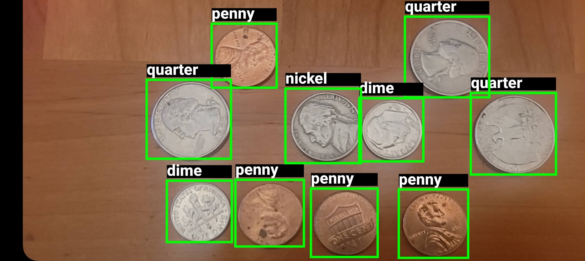
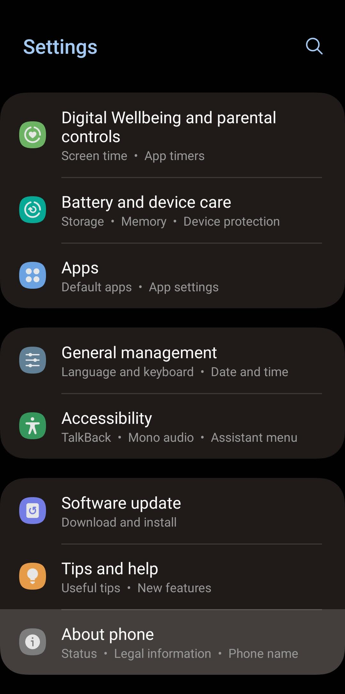
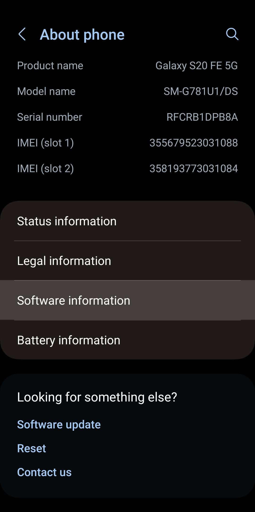
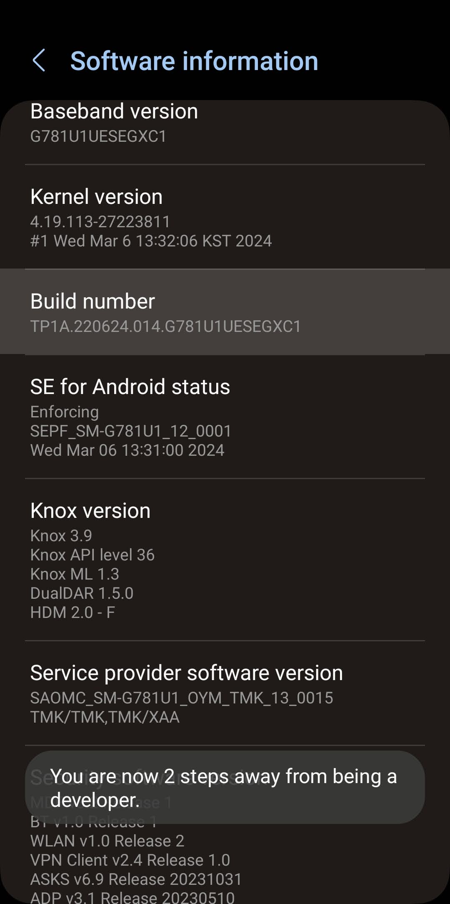
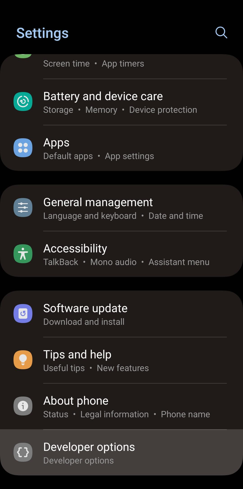
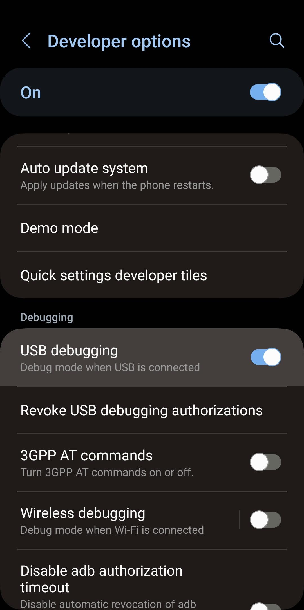

# How to Run TensorFlow Lite Models on Android
This guide shows how to load a TensorFlow lite model on an Android device to detect objects using the rear camera.

   

## Requirements
An Android device with an API level of 24+. This covers 97% of all active Android devices.
A phone is highly recommended. Tablets don't have the same performance or camera quality.

## Step 1. Train your TensorFlow Lite model
[Google Colab Notebook](https://colab.research.google.com/github/EdjeElectronics/TensorFlow-Lite-Object-Detection-on-Android-and-Raspberry-Pi/blob/master/Train_TFLite2_Object_Detction_Model.ipynb)

Make sure to follow Step 8.2.4. for deploying on Android. It's required to initialize your model on the device.

## Step 2. Setup your device for use with Android Studio
[Run apps on a hardware device](https://developer.android.com/studio/run/device)
By default, Android devices can't launch apps from Android Studio.
The link above covers all examples for different phones, but the following should look similar for most devices.

Go to Settings -> About Phone -> Software Information

   
   

Tap Build Number 7 times -> Return to Settings, Developer Options will be revealed under About Phone 

   
   

Enter Developer Options and Enable it -> Select USB Debugging
Connect a USB cable between your computer and device

   

## Step 3. Download and Install Android Studio
[Download Android Studio](https://developer.android.com/studio)

## Step 4. Open Android Studio and the Project

   

## Step 5. Add your TFlite Model to the Project

   

   

   

   
   

