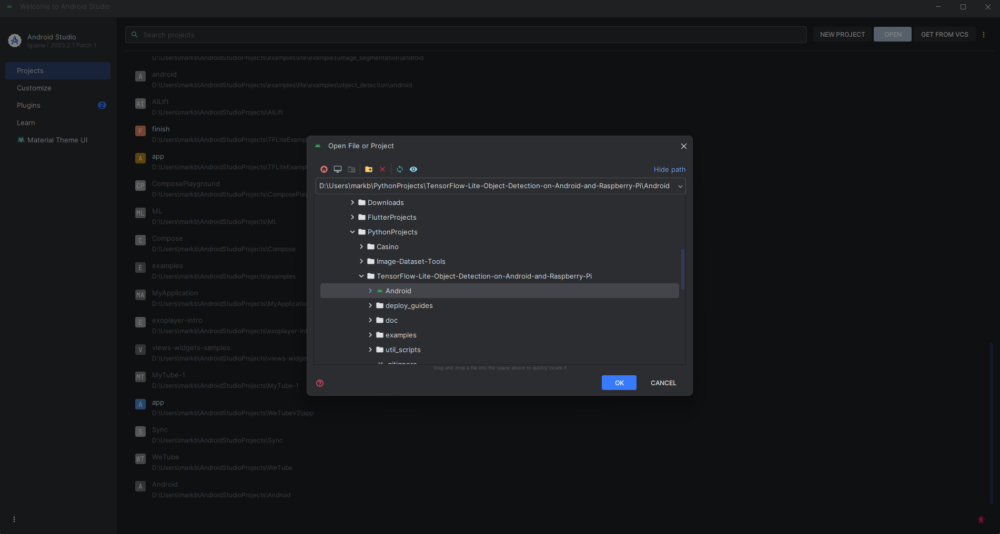
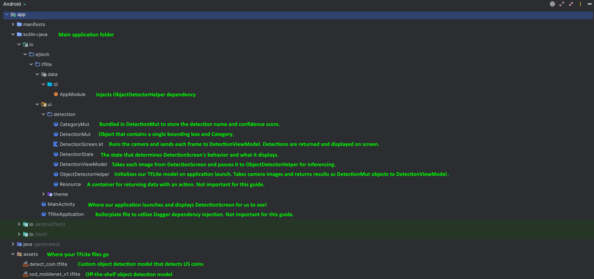
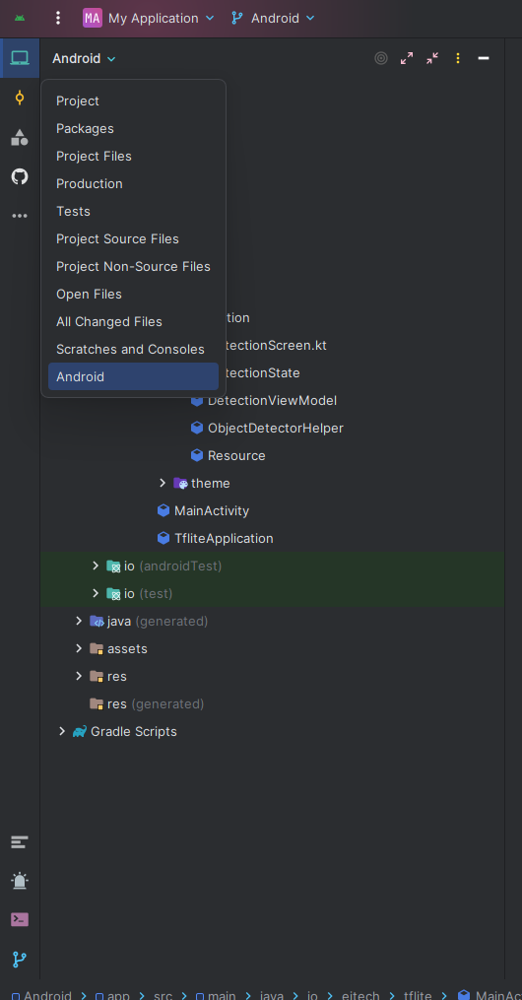
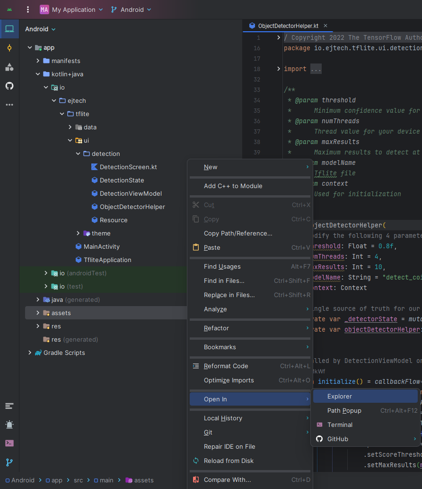
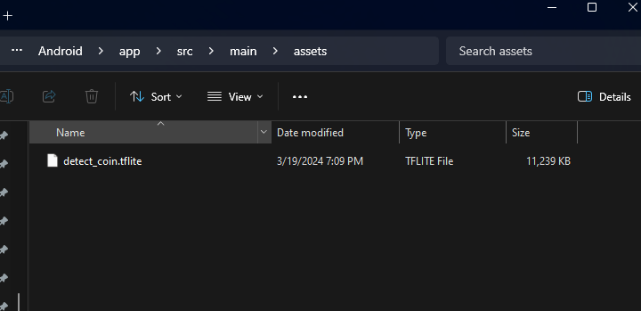
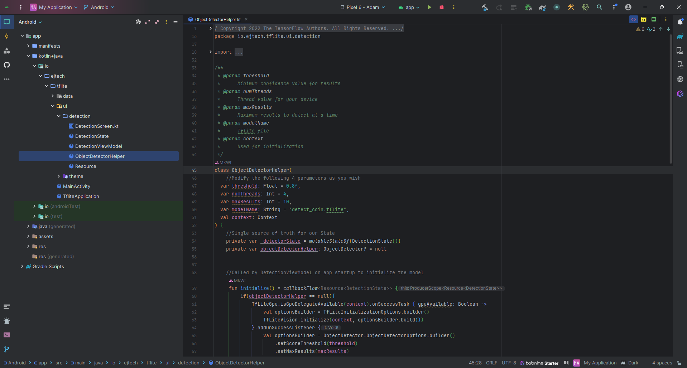
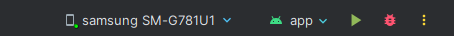

# How to Run TensorFlow Lite Models on Android
This guide shows how to load a TensorFlow Lite model on an Android device to detect objects using the rear camera. It walks through the process of setting up a project in Android Studio, adding your custom TFLite model to the project, and deploying it to your Android phone.

   

## Requirements
Running TFLite models requires an Android device with an API level of 24 or higher (Android 7.0 or higher). This covers 97% of all active Android devices. For more information on API levels, see the [Android SDK Platform release notes page.](https://developer.android.com/tools/releases/platforms)
For this guide, using a phone is highly recommended. Android tablets typically don't have as good of performance or camera quality.

## Step 1. Train your TensorFlow Lite model
[Google Colab Notebook](https://colab.research.google.com/github/EdjeElectronics/TensorFlow-Lite-Object-Detection-on-Android-and-Raspberry-Pi/blob/master/Train_TFLite2_Object_Detction_Model.ipynb)

## Step 2. Set Up Your device for Use With Android Studio
Next, you'll need to enable Developer Options on your Android device. This allows it to load and run custom apps, like the one you'll be creating in this guide. The following steps and images show the process for a typical Android phone. If your device has a different Settings menu, visit the [Run apps on a hardware device](https://developer.android.com/studio/run/device) page for specific instructions for your device.

1. Navigate to Settings -> About Phone -> Software Information.

   
   

2. Tap the "Build number" item 7 times, then return to Settings. Developer Options will be revealed under About Phone.

   
   

3. Enter Developer Options and enable it by toggling the top option to "On". Also enable the USB Debugging option.

   

## Step 3. Download and Install Android Studio
Now we need to download and install Android Studio, which will be used to write and build the application. Visit the [Android Studio page](https://developer.android.com/studio) and click the Download Android Studio button. Once it's downloaded, run the installer and use the default install options.

## Step 4. Set Up Project in Android Studio
The Android folder in this repository contains all the files for an Android Studio project with code to build an object detection app. Open a terminal and clone the repository using the following command. 

`git clone https://github.com/EdjeElectronics/TensorFlow-Lite-Object-Detection-on-Android-and-Raspberry-Pi.git --depth=1`

Note: If you're on Windows and don't have `git` installed, you can just visit the main page of this repository, and click Code -> Download ZIP to download a zipped repository folder.
Once the repository is cloned, launch Android Studio. The first time you open Android Studio, it will go through a Setup Wizard, where you can again use the default options. You'll need to accept each License Agreement and download some extra components. 

When it reaches the Welcome to Android Studio screen, click Open, navigate to the folder where the repository was cloned, and select the Android folder. Click "Trust Project" when asked.

   

   

## Step 5. Add Your TFLite Model to the Project

Click the Project dropdown in the upper left corner and select Android. Click the `app` folder, then expand every subfolder by clicking the Expand All button (or pressing Ctrl + NumPad+ on the keyboard).

   

Right-click on the `assets` folder and select Open In -> Explorer. Move the `android_model.tflite` file you downloaded from the Colab Notebook into this folder.

   
   

Find the ObjectDetectorHelper file in the `kotlin+java/io.ejtech.tflite/ui/detection` folder in the navigation panel on the left. Double-click it to open it. This file contains adjustable parameters for the app. For example, the `var threshold` variable sets the minimum confidence threshold for displaying detected objects.

If your model name is different than `android_model.tflite`, change the `modelName` variable to match the name of the model file.

   

## Step 6. Launch App on Your Device!

Connect your Android device to the PC using a USB cable. You should see the name of your phone appear at the top of Android Studio. Once connected, press the green arrow button to build and launch the app on your phone. Depending on the speed of your computer and the amount of dependencies that need to be downloaded on the first launch, it may take 3 to 5 minutes.
Connect your device by USB and you should see the name of your phone appear at the top. Once connected, press the green arrow button to launch the app.
Depending on the speed of your computer and any dependencies that need to be downloaded on the first launch, it may take a little bit of time

   

If everything worked successfully, your phone should show a live view of your camera with detected objects drawn on each camera frame. 

Congratulations! You've successfully built and run an Android app that uses your custom TFLite model detect objects. If you ran into any errors, first try a brief Google search to see if you can find a solution. If a Google search doesn't reveal the fix, feel free to submit the problem on the Issues page for this repository.

